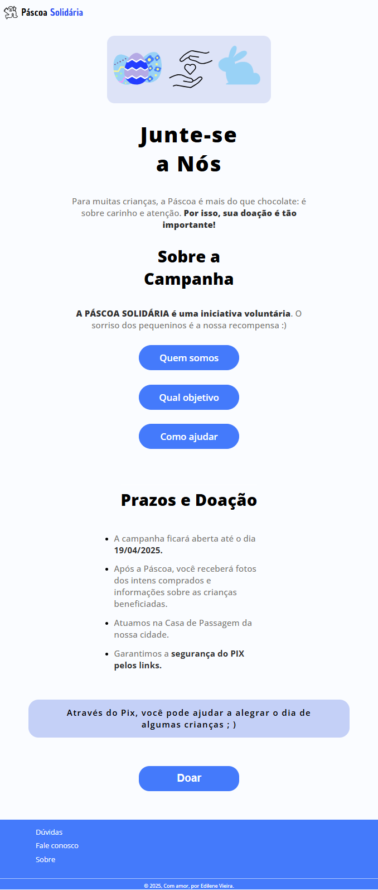

## Descrição
O projeto tem como finalidade dar facilidade para uma campanha feita por amigos para que
consigam doações para levar um pouco mais de felicidade a crianças de uma casa de apoio.

## Tecnologias Utilizadas
- HTML
- CSS
- JAVASCRIPT
- Figma e Canva (Todo visual de cores foi projetado por nós)

## Contato
Para mais informações, entre em contato com [lbastos722@gmail.com].

## Imagem do projeto
